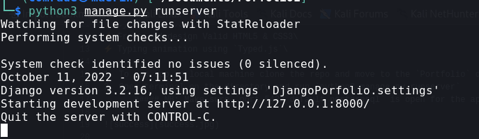
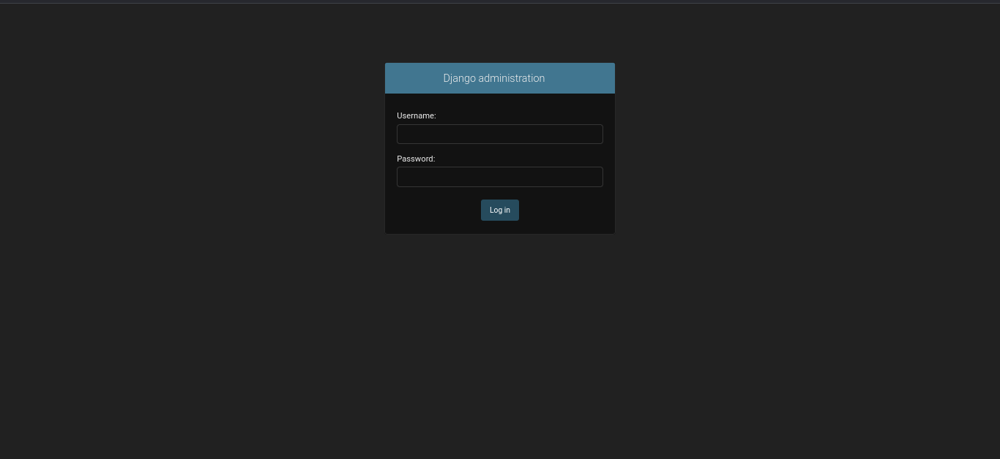
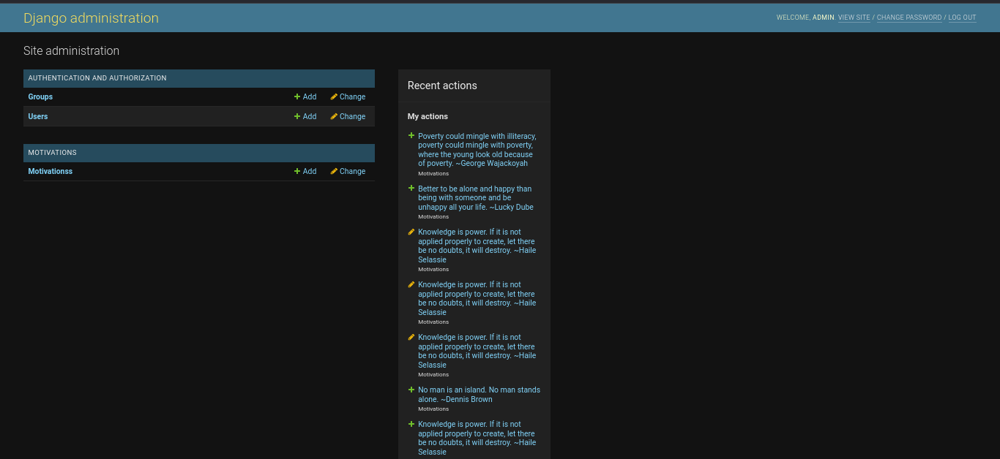

# Django-Content-Management-App.
A Django content management app to post feeds,news etc.Supported by a Postgres database to store your contents.

### View live website on 

## Features

⚡️ Fully Responsive\
⚡️ Django & Postgres\
⚡️ Front-end design Valid HTML5 & CSS3\
⚡️ Typing animation using `Typed.js`\

1. To run app on local machine clone the repo and move to the `Portfolio` directory.
2. Open terminal on the directory and run `python3 manage.py runserver`
      ##### NB: Make sure `port 5432 default postgresql` is open for the app to run successfully.
      

3. After the successful setup open the browser and move to `http://localhost:8000/admin` to setup your content.

4. Default Login credentials `username:admin` and `password:django1234`.

5. After successful adding your content in the motivation section move to the site at `http://localhost:8000` to view your content. 

### NB: Change the postgres database configuration in the `settings.py. 
###    Change the display by altering the css and html to fulfill you design.

